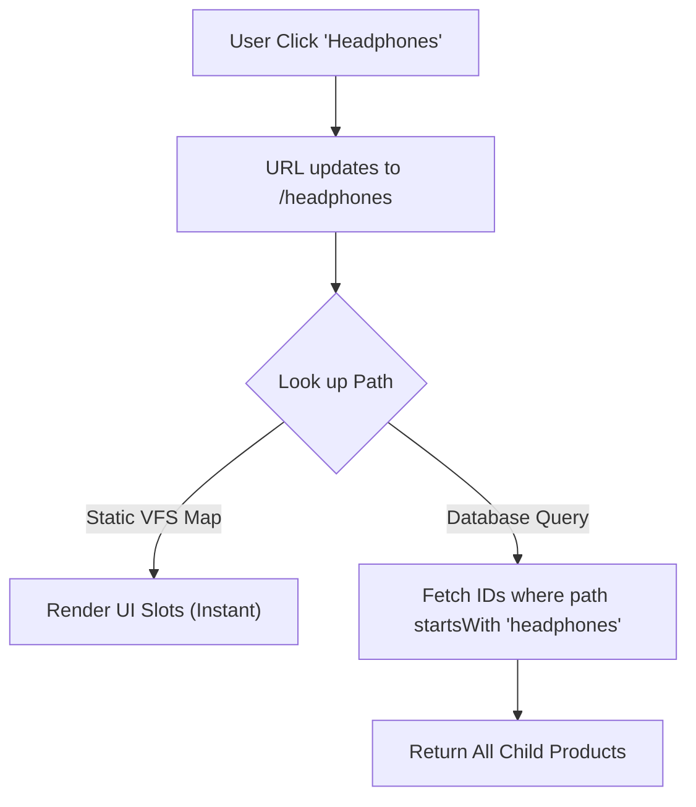

#  Feature name

## 1. The Problem
* **Pain Point:**
* **Impact:**

## 2. The Solution
* **Strategy:** <short name or description>
* **Mechanism:**
    // name key aspect 1 : short description
    // name key aspect 2 : short description
    // name key aspect 3 : short description
    // ...
* **Tech Stack:** Next.js, Node.js (Virtual File System Generator), Sanity (Groq Prefix Matching).

## 3. Architecture

How does <feature name> work?

1. The Core Mechanism:

<mermaid diagram>

// key criteria
* **Ease of change:**
* **Instant look up:**

## 4. Key Trade-offs
**Decision**:

**Reasoning**: