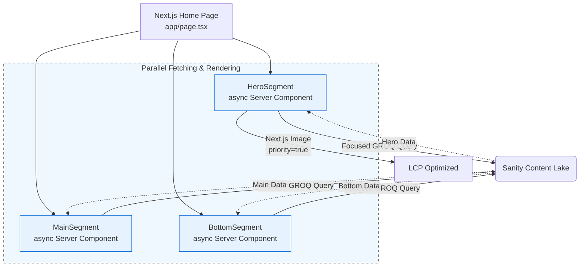

# Home Page Data Orchestrator

## 1. The Problem
* **Pain Point:** Fragmented, asynchronous fetching across multiple page segments creates network waterfalls, high developer cognitive load when tracking data flow, and unpredictable LCP (Largest Contentful Paint) performance.
* **Impact:** Increased Sanity API costs due to redundant requests, layout shift (CLS) during component hydration, and slower build times for static generation.

## 2. The Solution
* **Strategy:** Colocated Parallel Data Fetching with React Server Components.
* **Mechanism:**
    * **Parallel Independent Queries:** Each page segment (Hero, Main, Bottom) is an async server component that fetches only its required data via a focused GROQ query. Next.js executes these fetches concurrently during server rendering—no waterfalls.
    * **Zero Prop-Drilling:** Data stays local to the component that needs it, eliminating complex slicing, interfaces, or orchestration logic.
    * **Native LCP Optimization:** Use Next.js `<Image priority={true}>` in the Hero component for automatic resource hints and preloading—no manual HTML shell intervention needed.
    * **Automatic Deduplication & Caching:** React's built-in cache dedupes identical queries within a request; Sanity client caching handles repeats across requests.
* **Tech Stack:** Next.js 15 (App Router), React 18 (RSC), Sanity 3 (GROQ).

## 3. Architecture

How does the Data Orchestrator work?

1. The Core Mechanism:

# Sanity Schema Design

- **Single Source of Truth**: One singleton `homepage` document. All content editors manage the homepage in one place — atomic publishes, no coordination between multiple documents, simple previews/drafts.
- **Colocated Parallel Fetching Compatibility**: Each segment (`HeroSegment`, `MainSegment`, `BottomSegment`) runs its own focused GROQ query against the single `homepage` document, selecting only the fields it needs. Next.js executes them in parallel — no waterfalls, no mega-query.
- **No Portable Text / Block Content**: Replaced with simple `string` for short text and `text` (multi-line, markdown-supported) for longer bodies. Frontend renders with a lightweight markdown parser (e.g., `react-markdown` or `remark`).
- **Explicit Structure Where Predictable**: Hero overlays use dedicated fields (eyebrow, headline, subhead, CTA) — no ambiguous "role" arrays needed, as the layout is fixed in code.
- **Flexibility for Reordering/Moving Sections**: `mainSections` and `bottomSections` are separate orderable arrays of polymorphic sections. Editors can reorder within an array via drag-and-drop. Moving a section between Main ↔ Bottom requires deleting from one array and recreating in the other.
- **Manual Control**: All product selections are manual references. No auto-queries by date/sales.
- **Images from CMS**: All backgrounds and assets are Sanity images (with hotspot + alt).
- **Minimal Custom Types**: Reusable objects only where it reduces repetition (`promotionContent`, `heroSlide`).
- **Future-Proof**: Easy to add new section types by extending the `sectionType` list and adding conditional fields.