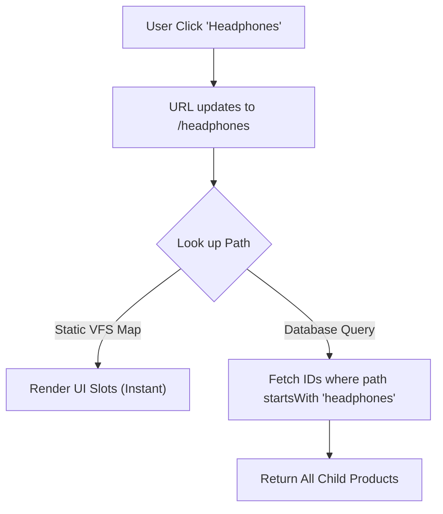

# Static Catalogue Indexing & Path-Based Inheritance

## 1. The Problem
* **Pain Point:** Traditional e-commerce categories require complex, recursive database queries to handle parent/child relationships (e.g., *"Show me all Headphones, including sub-categories"*).
* **Impact:** These "tree traversal" queries are computationally heavy, causing database bottlenecks and slow response times as the catalogue grows.

## 2. The Solution
* **Strategy:** **Path-Based Prefix Matching**. I flattened the entire category tree into a "Virtual File System".
* **Mechanism:**
    * **The Structure:** A build-time script generates a static map of all valid paths.
    * **The Fetch:** When a user visits `/headphones`, I don't traverse a tree. I simply fetch all products where the `path` string starts with `headphones`.
    * **The Drill-down:** Clicking `/headphones/earbuds` just narrows the prefix string.
* **Tech Stack:** Next.js, Node.js (Virtual File System Generator), Sanity (Groq Prefix Matching).

## 3. Architecture
* **Ease of change:** Moving a catalogue slot AUTOMATICALLY moves ALL associated products to new location - and query AUTOMATICALLY works with the new location. E.g. if we moved "Speakers" to some new location "X", user clicking "X" would now fetch all "Speakers" too, while clicking "Speakers" would fetch just "Speakers" as it did before. Any catalogue change whatsoever involves exactly 0 subsequent update needs to make it work. How? It's a graph-like virtual file system. Catalogue pathways, product positions and catalogue slots are 3 concerns desirably 100% de-coupled.
* **Instant look up:** Database stores catalogue slots that house product ids. Storefront receives map of catalogue "starts with" pathways -> pathway selection yields all associated product ids instantly, resulting in some product ids database fetch.

## 4. Key Trade-offs
**Decision**: Pre-computed Paths + Daily Rebuilds vs Per change updates catalogue DB webhook + re-validation on /api/revalidate route with cache.

**Reasoning**: I prioritized real time User Experience - catalogue interaction should be instantenous and lightning fast. By treating categories as "file paths" rather than nested nodes, product retrieval becomes a simple string match operation (O(1) complexity). The cost is that changing the catalogue in database and seeing immediate change is not possible, except via rebuild. This is solved by providing daily automatic app re-build and a manual button to trigger re-build. The store sells audio gear - catalogue does not change that often, so real time catalogue changes aren't a priority.  But the benefit is that catalogue feels instantaneous to the user regardless of depth because it's a map of paths and product id's "wiring" to those paths.