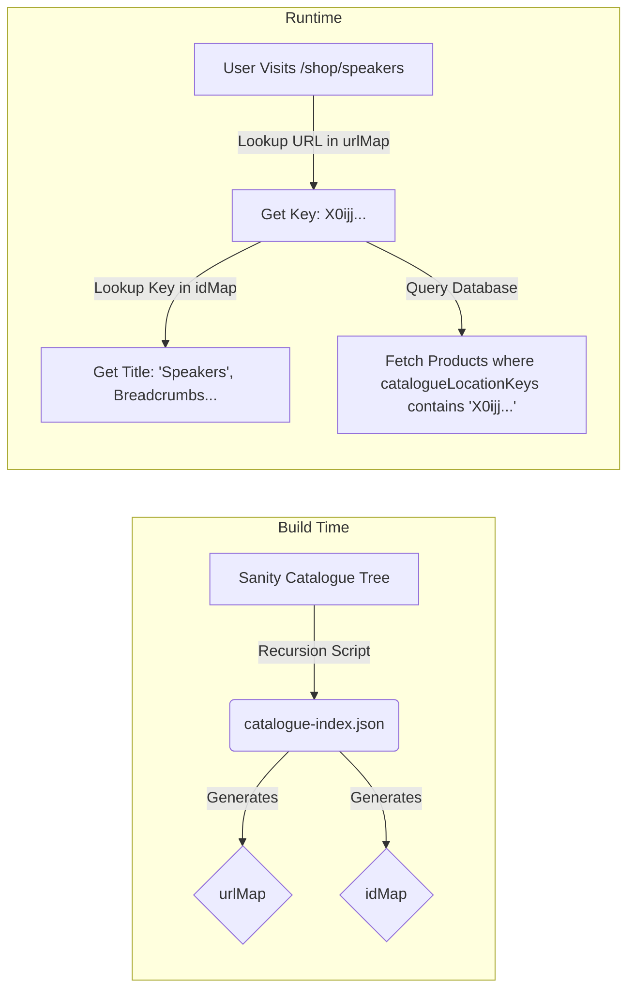
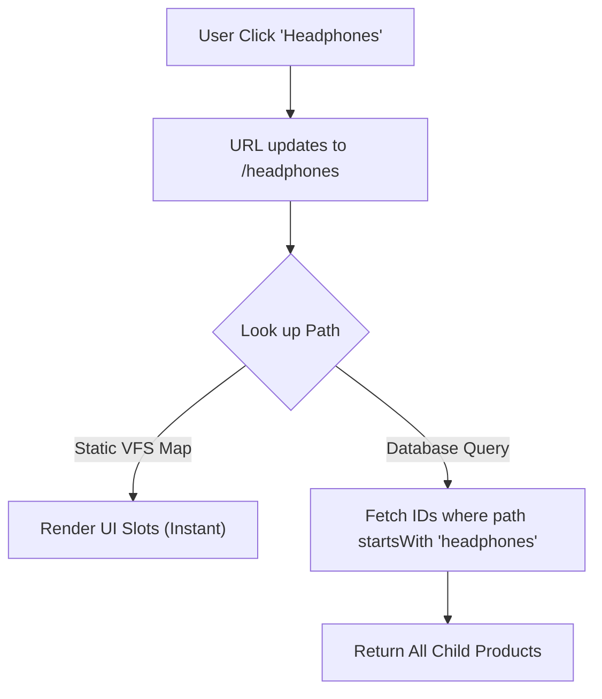

# Static Catalogue Indexing & Path-Based Inheritance

## 1. The Problem
* **Pain Point:** Traditional e-commerce categories require complex, recursive database queries to handle parent/child relationships (e.g., *"Show me all Headphones, including sub-categories"*).
* **Impact:** These "tree traversal" queries are computationally heavy, causing database bottlenecks and slow response times as the catalogue grows.

## 2. The Solution
* **Strategy:** **Path-Based Prefix Matching**. I flattened the entire category tree into a "Virtual File System".
* **Mechanism:**
    * **The Structure:** A build-time script generates a static map of all valid paths.
    * **The Fetch:** When a user visits `/headphones`, I don't traverse a tree. I simply fetch all products where the `path` string starts with `headphones`.
    * **The Drill-down:** Clicking `/headphones/earbuds` just narrows the prefix string.
* **Tech Stack:** Next.js, Node.js (Virtual File System Generator), Sanity (Groq Prefix Matching).

## 3. Architecture

How does catalogue work?
This architecture is a referential decoupling system. It separates "Where a product lives" (The Catalogue) from "What a product is" (The Product Schema), using a static build-time map to bridge them.

1. The Core Mechanism: "The Shelf ID"
The system relies on a single persistent anchor: the Catalogue Node Key (_key in Sanity).

The Map (catalogue_index.json): This is your store directory. It says, "Shelf ID zemHa... is located at aisle /headphones and is called 'Headphones'."

The Product: The product acts like a box in a warehouse. It doesn't know it's in the "Headphones" aisle. It only knows: "I belong on Shelf ID zemHa..." (stored in catalogueLocationKeys).

The Magic: When you move the "Headphones" shelf to a new aisle in Sanity (e.g., /audiophile/headphones), the Map updates the path. The Product holds the same Shelf ID. Therefore, the product effectively moves without you ever touching the product document.

Another extremely useful feature of this architecture is that the script distinguishes between link and header types. This allows to create visual clusters (e.g., "By Category" or "By Fit") in the UI that do not affect the URL structure. This keeps URLs clean (/headphones/wired instead of /headphones/by-category/wired). And it could, if need be, be extended. The recursive map making script has a step of type recognition.

How does updating catalogue in database with quick storefront feedback work?

First of all, this is where this architecture truly shines. It's extremely strong in this regard because a product isn't really in a place. There is no "location" where the product is.  A product is in a "startsWith pathway" mechinism. A product id wires up to some catalogue slots it belongs to - but that doesn't mean the product is IN those catalogue slots. It's not. A product is in a "startsWith pathway" mechanism.
This causes extreme strength (in terms of ease of change) of this approach because moving a catalogue item to another catalogue location - laterally or vertically - AUTOMATICALLY moves ALL associated products to their rightful new place with ZERO COMPLICATIONS whatsoever. There's nothing to update, nothing to modify, nothing complicating with anything else, nothing is needed for the catalogue item movement to result in the 100% exact and accurate changes in product browsing experience. The reason that's possible is also because Sanity DB _id are immutable. Moving or updating never changes _id.

I appended webhook to database catalogue changes. It hits  /api/revalidate on any catalogue change, which then re-validates catalogue cache tag in Next app. That causes silent re-fetch and background product ids pathways mapping script.
Sanity database catalogue change -> webhook -> /api/revalidate revalidateTag (catalogue cache tag) -> storefront catalogue server component re-fetches updated catalogue -> storefront catalogue consumer component gets new catalogue.
Meanwhile User Experience - INSTANT PERFORMANCE AND 0 LAG RETAINED because the user gets stale data, while catalogue update happens in the background.
How that works in practice:
- say, you update a catalogue slot - move "bluetooth receiver" to new position
- that will trigger update (as described above) - but when user views catalogue, they'll see the old catalogue (0 lag)
- if they view catalogue a few seconds later, they'll see the updated catalogue (with the "bluetooth receiver" moved to that new position)
- that doesn't matter for the user - catalogue changes far more rarely than something like e.g. a blog, and even blogs have typically far more wait time than this

Why does that matter?
- so you can edit the catalogue in sanity db, and see changes immediately
- let's say catalogue update is needed, you can do that in the early morning before any customers are online - and edit with live feedback to "see how it looks like"

This function is ideal for content where a slight delay in updates is acceptable, such as blog posts, product catalogs, or documentation. Users receive stale content while fresh data loads in the background.

* **Ease of change:** Moving a catalogue slot AUTOMATICALLY moves ALL associated products to new location - and query AUTOMATICALLY works with the new location. E.g. if we moved "Speakers" to some new location "X", user clicking "X" would now fetch all "Speakers" too, while clicking "Speakers" would fetch just "Speakers" as it did before. Any catalogue change whatsoever involves exactly 0 subsequent update needs to make it work. How? It's a graph-like virtual file system. Catalogue pathways, product positions and catalogue slots are 3 concerns desirably 100% de-coupled.
* **Instant look up:** Database stores catalogue slots that house prod`uct ids. Storefront receives map of catalogue "starts with" pathways -> pathway selection yields all associated product ids instantly, resulting in some product ids database fetch.

## 4. Key Trade-offs
**Decision**: Pre-computed Paths + Daily Rebuilds vs Per change updates catalogue DB webhook + re-validation on /api/revalidate route with cache.

**Reasoning**: I prioritized real time User Experience - catalogue interaction should be instantenous and lightning fast. By treating categories as "file paths" rather than nested nodes, product retrieval becomes a simple string match operation (O(1) complexity). The cost is that changing the catalogue in database and seeing immediate change is not possible, except via rebuild. This is solved by providing daily automatic app re-build and a manual button to trigger re-build. The store sells audio gear - catalogue does not change that often, so real time catalogue changes aren't a priority.  But the benefit is that catalogue feels instantaneous to the user regardless of depth because it's a map of paths and product id's "wiring" to those paths.