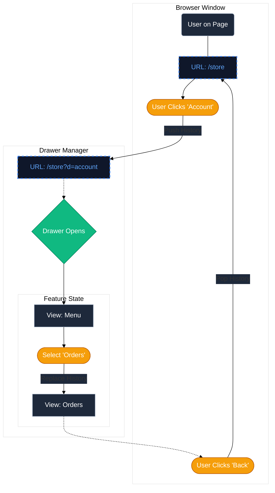

# 🗄️ URL-Driven Drawer System

## 1. Problem

Managing global UI state (like Modals, Drawers, and Panels) often leads to:

- **Lag/Bad user experience:** Next's native parallel routes + route interception LAGS. On lower device settings and connections, user might wait 0.5-1 SECOND until _just the url changes_!
- **Prop Drilling:** Passing `isOpen` through multiple layers.
- **Sync Issues:** The URL doesn't reflect the UI, breaking the "Back" button.
- **Layout Shift:** Rendering heavy drawer content inside the main tree causes re-renders.

## 2. Solution: Shallow Routing

I use `nuqs` library to sync the drawer state directly to the URL search parameters. The `DrawersManager` acts as a single "Shell" that subscribes to the `?drawer=` parameter, dynamically rendering the correct feature component.

## 3. Architecture

