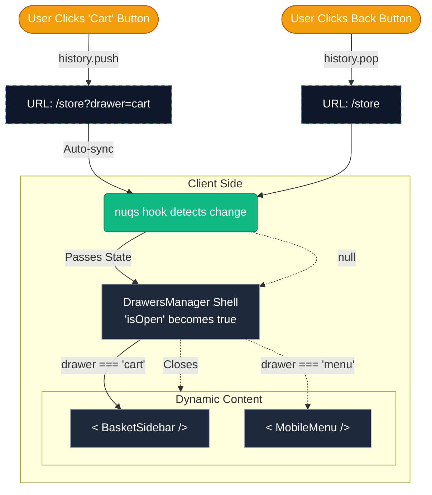

# 🗄️ URL-Driven Drawer System

## 1. Problem

Managing global UI state (like Modals, Drawers, and Panels) often leads to:

- **Lag/Bad user experience:** Next's native parallel routes + route interception LAGS. On lower device settings and connections, user might wait 0.5-1 SECOND until _just the url changes_!
- **Prop Drilling:** Passing `isOpen` through multiple layers.
- **Sync Issues:** The URL doesn't reflect the UI, breaking the "Back" button.
- **Layout Shift:** Rendering heavy drawer content inside the main tree causes re-renders.

## 2. Solution: Shallow Routing

I use `nuqs` library to sync the drawer state directly to the URL search parameters. The `DrawersManager` acts as a single "Shell" that subscribes to the `?drawer=` parameter, dynamically rendering the correct feature component.

## 3. Why? Key Choices & Trade-offs

**Lean Stack vs. Practical Performance**
* My default approach is to delete dependencies, not add them. However, Next.js native Parallel Routes were a **hard NO**—the latency on route interception was unacceptable.
* I considered using global state (Zustand/Redux), but that breaks the "Back" button navigation.
* Introducing `nuqs` was the lightweight solution that solved both problems: it keeps the stack lean while guaranteeing instant responsiveness. In the end, this wasn't much of a trade-off; it was the only viable path for a professional-grade UX.

**Instant Responsiveness vs. URL Aesthetics**
* Instant responsiveness is paramount for drawers, especially for users on slower connections (3G/4G/LTE).
* The "cost" is a slightly noisier URL (`?drawer=cart`), but this is negligible compared to the benefit of deep-linking.
* I rely on `nuqs` because it's battle-tested; the risk of corrupting the browser history stack is near zero, allowing me to trust the library while I focus on the feature logic.

## 4. Architecture

The DrawersManager acts as a global "host" component that listens to the ?d URL parameter to dynamically render the correct feature (Cart, Menu, Account) inside a shared UI shell.

Critically, opening a drawer creates a new browser history entry (PUSH) so the hardware "Back" button closes it, while internal navigation (like switching Account tabs) updates the current history entry (REPLACE) to prevent trapping the user in a history loop.

